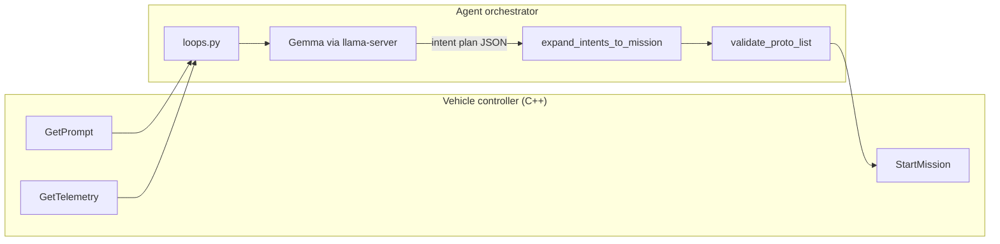

# Agent

Agent is the Python orchestrator for an autonomous drone stack. It turns natural-language operator prompts into validated flight missions, uploads them to the vehicle controller over gRPC, and optionally runs onboard vision (ArduCam + Hailo YOLO) with an automatic person-rescue path.

The core design separates **what to do** (LLM-produced intent DSL) from **where to fly** (deterministic waypoint math from live telemetry). Gemma never emits raw latitude/longitude; Python expands intents into protobuf mission items the controller can execute.

For build instructions, environment variables, vision tuning, intent tables, rescue behavior, and tests, see **[DETAILED.md](DETAILED.md)**.

## Quick start

### 1. Clone and install Python deps

```bash
git submodule update --init --recursive
uv sync
```

### 2. Download Gemma 4 E2B models (Unsloth GGUF)

`agent/scripts/run-llama-server.sh` expects these files under `agent/models/`:


| File                         | Role                                                                                        |
| ---------------------------- | ------------------------------------------------------------------------------------------- |
| `gemma-4-E2B-it-Q4_K_M.gguf` | Text model (mission planning)                                                               |
| `mmproj-F16.gguf`            | Vision projector (multimodal / rescue image analysis; omit if `RESCUE_IMAGE_LLM_ENABLED=0`) |


Download both from the [Unsloth Gemma 4 E2B GGUF repo](https://huggingface.co/unsloth/gemma-4-E2B-it-GGUF) (~3.1 GB + ~986 MB). 

Direct links: [gemma-4-E2B-it-Q4_K_M.gguf](https://huggingface.co/unsloth/gemma-4-E2B-it-GGUF/resolve/main/gemma-4-E2B-it-Q4_K_M.gguf) · [mmproj-F16.gguf](https://huggingface.co/unsloth/gemma-4-E2B-it-GGUF/resolve/main/mmproj-F16.gguf)

Alternatively, use the Hugging Face CLI: `huggingface-cli download unsloth/gemma-4-E2B-it-GGUF gemma-4-E2B-it-Q4_K_M.gguf mmproj-F16.gguf --local-dir agent/models`

### 3. Run llama-server

On a desktop or Mac, build llama.cpp and start the server:

```bash
make build-llama && make run-llama-server   # terminal 1: llama-server on :8080
```

On a Raspberry Pi 5 (8 GB), use a prebuilt binary instead of building (see below).

### 4. Run the orchestrator

**Local demo / no controller:** set in `agent/.env.orchestrator`:

```bash
LOCAL_TEST_MODE=1
```

Then (terminal 2, no `GRPC_TARGET` needed):

```bash
make run-loops
```

Type a natural-language mission at the prompt; the loop expands intents and logs mission points without uploading.

**With gRPC controller:** set `LOCAL_TEST_MODE=0` (or leave unset) and point at your C++ `InternalService`:

```bash
export GRPC_TARGET=127.0.0.1:50051
make run-loops
```

### Raspberry Pi 5 (8 GB): prebuilt `llama-server`

On an 8 GB Raspberry Pi 5, **do not** run `make build-llama`. Compiling llama.cpp from source can use several gigabytes of RAM during linking and often fails with out-of-memory errors while the rest of the stack (orchestrator, YOLO, camera) also needs memory.

Instead, download the official **Ubuntu arm64 (CPU)** release binary into the path expected by `agent/scripts/run-llama-server.sh` (default `BINARY_PATH`: `agent/llama.cpp/build/bin/llama-server`). Extract the tarball into that directory so `llama-server` and its bundled `.so` libraries sit side by side.

From the repository root on the Pi:

```bash
LLAMA_RELEASE=b8884   # match the llama.cpp submodule tag, or pick a newer release
mkdir -p agent/llama.cpp/build/bin
curl -fL -o /tmp/llama-arm64.tar.gz \
  "https://github.com/ggml-org/llama.cpp/releases/download/${LLAMA_RELEASE}/llama-${LLAMA_RELEASE}-bin-ubuntu-arm64.tar.gz"
tar -xzf /tmp/llama-arm64.tar.gz -C agent/llama.cpp/build/bin --strip-components=1
chmod +x agent/llama.cpp/build/bin/llama-server
```

Then start the server as usual: `make run-llama-server` (after downloading the Unsloth models in step 2 above).

If you use a different install layout, override `BINARY_PATH` in `agent/.env.orchestrator` to point at your `llama-server` executable.

## How it works




### The loop

`agent/orchestrator/loops.py` is the main entry point (`python -m agent.orchestrator.loops`).

In **gRPC mode** the loop:

1. Opens an `InternalGrpcClient` to the controller and starts a background telemetry poller (`GetTelemetry` → `TelemetryCache`).
2. Polls `GetPrompt` on an interval. When the prompt string changes (and is non-empty), it plans a new mission.
3. Calls `_plan_from_prompt`: updates `MissionState`, asks the LLM for an intent plan, expands it to waypoints, validates, then `StartMission`.
4. Records home on the first `takeoff` intent (used by the optional rescue path).

In **local test mode** (`LOCAL_TEST_MODE=1`), prompts are read from stdin and telemetry comes from env defaults; expansion and logging still run, but nothing is sent over gRPC.

The same prompt text is not processed twice in one process lifetime; change the prompt on the controller side to request a new mission.

### Mission intents

A **mission intent plan** is JSON shaped as `{ "mission_name": "...", "intents": [ ... ] }`. Each intent is a typed object such as `takeoff`, `move_directional`, `comb_square_area`, or `land`.

Intent types are declared once in `agent/orchestrator/mission_intents/intent_specs.py` as `IntentSpec` entries. Each spec provides:

- A JSON Schema branch used to constrain Gemma’s structured output (`MISSION_INTENT_SCHEMA` in `llm/schemas.py`).
- A Python **handler** registered in `IntentRegistry` (`mission_intents/registry.py`).

Handlers live in `basic.py` (movement, takeoff, land, safety, yaw, loiter, etc.) and `area_patterns.py` (area sweeps). Adding a new capability means a new spec + handler + few-shot examples in `llm/prompts.py`; see DETAILED.md.

Phase-1 movement is **world-frame** (compass directions and bearings), not body-relative forward/back/left/right. `safety_control` can preempt later movement intents; `land` still runs after preemption.

### Deterministic expansion

`expand_intents_to_mission()` in `mission_intents/expand.py` walks the intent list in order:

1. Seeds an `ExpansionContext` from the current telemetry position (origin lat/lon, cumulative north/east/altitude offsets, pending yaw).
2. Resolves each intent’s handler from the registry and appends `MissionItem` protobuf messages via `build_proto_item()` in `proto.py`.
3. Uses flat-earth geometry (`geometry.py`) so every waypoint is derived from the origin plus offsets, never from LLM coordinates.

Given the same telemetry snapshot and intent plan, expansion is fully reproducible. Operator missions and the autonomous rescue mission both use this same path.

### Validity checks

Checks run in layers before any upload:


| Layer        | Where                       | What                                                                                                      |
| ------------ | --------------------------- | --------------------------------------------------------------------------------------------------------- |
| Plan input   | `expand.py`                 | Non-empty `intents`; telemetry lat/lon in range                                                           |
| Per waypoint | `proto.validate_proto_item` | Lat/lon, altitude 0–50 m, speed ≤ 4 m/s, yaw range, `camera_action == 0`, allowed `vehicle_action` values |
| Mission list | `proto.validate_proto_list` | At least one item; first-item gimbal contract                                                             |
| Pre-upload   | `expand._validate_contract` | Re-validates the full list before `StartMission`                                                          |


The LLM is additionally constrained by the JSON schema derived from intent specs; `LlamaClient` retries on malformed JSON. Failures set `MissionState` to error and emit `mission_upload_failed` in the optional JSONL pipeline log (stage: `llm_plan`, `intent_expansion`, or `start_mission_rpc`).

### Communication with the controller

`agent/orchestrator/grpc_client.py` wraps the generated `InternalService` stub (`protoc/internal_communication.proto`):


| RPC            | Direction          | Purpose                                     |
| -------------- | ------------------ | ------------------------------------------- |
| `GetPrompt`    | Controller → agent | Operator mission request (natural language) |
| `GetTelemetry` | Controller → agent | Position and altitude for expansion         |
| `StartMission` | Agent → controller | Upload validated `MissionItemList`          |


Configure the target with `GRPC_TARGET` (default `localhost:50051`). Settings are loaded from the environment via `config.Settings.from_env()`; see `agent/.env.orchestrator` for common variables.

A minimal connectivity smoke test: `python -m agent.orchestrator.main` (one telemetry sample).

## Repository layout (orchestrator)


| Path                                  | Role                                              |
| ------------------------------------- | ------------------------------------------------- |
| `agent/orchestrator/loops.py`         | Main async loop                                   |
| `agent/orchestrator/grpc_client.py`   | gRPC client                                       |
| `agent/orchestrator/llm/`             | Prompts, schema, llama-server client              |
| `agent/orchestrator/mission_intents/` | Intent specs, expansion, geometry, proto builders |
| `agent/orchestrator/state/`           | Mission and telemetry state                       |
| `agent/orchestrator/inference/`       | Optional Hailo YOLO (with `ARDUCAM_VISION=1`)     |
| `agent/orchestrator/rescue/`          | Person-detected return-home path                  |
| `agent/tests/`                        | Unit tests (`uv run pytest -q agent/tests`)       |


## Further reading

- **[DETAILED.md](DETAILED.md)**: llama-server tuning, full intent table, vision env vars, JSON pipeline logs, rescue state machine, adding intents
- `agent/.env.orchestrator`: commented configuration template

